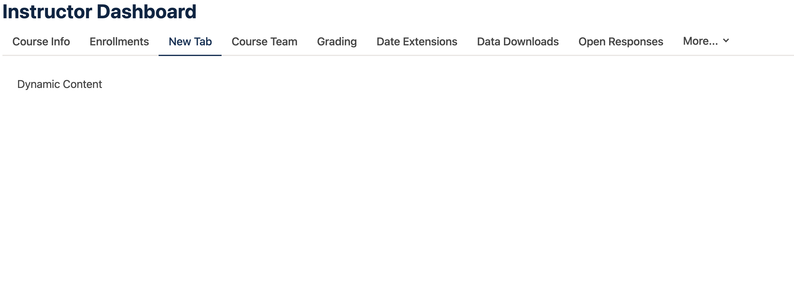

# `frontend-app-instruct` Slots

## Overview

Slots in `frontend-app-instruct` use the slot system from `@openedx/frontend-base` to provide modular extension points in the application. This system allows different widgets to be dynamically registered at specific UI locations.

## Slot Architecture

### Main Components

1. **Slot Operations**: Operation definitions that specify how and where widgets will be inserted
2. **Slot Components**: React components that act as containers for widgets
3. **Widget Components**: Individual components that are inserted into slots

## Instructor Tabs Slot

### Description
We created following slots to handle Instructor Tabs:
- Tab Slots uses the slot context to render tab widgets.
- Route Slots uses registered slots to render tab content dynamically.


### 1. Slot Operations Definition

For a working example add in `src/slots.tsx` following code:

```tsx
import { SlotOperation } from '@openedx/frontend-base';
import { WidgetOperationTypes } from '@openedx/frontend-base';
import { PlaceholderSlot } from './slots/instructorTabsSlot/instructorTabsSlot';

// Create slot operations for tabs
const tabSlots: SlotOperation[] = [
  {
    slotId: 'org.openedx.frontend.slot.instructor.tabs.v1',
    id: 'org.openedx.frontend.widget.instructor.tab.my_tab',
    op: WidgetOperationTypes.APPEND,
    element: <PlaceholderSlot tabId="my_tab" title="New Tab" url="my_tab" sortOrder={25} />,
  },
];

// Create slot operations for route and content
const routeSlots: SlotOperation[] = [
  {
    slotId: 'org.openedx.frontend.slot.instructor.routes.v1',
    id: 'org.openedx.frontend.widget.instructor.route.my_tab',
    op: WidgetOperationTypes.APPEND,
    element: <PlaceholderSlot tabId="my_tab" content={<div>Dynamic Content</div>} />,
  },
];

const slots: SlotOperation[] = [
  ...tabSlots,
  ...routeSlots,
];

export default slots;
```

#### UI with New Tab Selected and Dynamic Content Displayed




### 2. How it works
#### 2.1 Explanation on Slot Element

The `PlaceholderSlot` component acts as a placeholder that maintains the necessary props:

```tsx
export const PlaceholderSlot = (_props: Record<string, any>) => null;
```

#### 2.2 Explanation of Slot Consumer

[`InstructorNav`](../instructorTabsSlot/InstructorNav.tsx) component consumes the registered slots and tabs coming from the endpoint, orders them, and renders them.

[`TabContent`](../instructorTabsSlot/routes.tsx) consumes the registered slots for the content of each tab.

```tsx
const TabContent = () => {
  const { tabId } = useParams<{ tabId: string }>();
  const routeWidgets = useWidgetProps('org.openedx.frontend.slot.instructor.routes.v1') as InstructorRouteProps[];

  const tabRoutes = [
    ...defaultTabs.filter(
      defaultTab => !routeWidgets.some(slotTab => slotTab.tabId === defaultTab.tabId)
    ),
    ...routeWidgets
  ];

  return tabRoutes.find(tab => tab.tabId === tabId)?.content;
};
```
